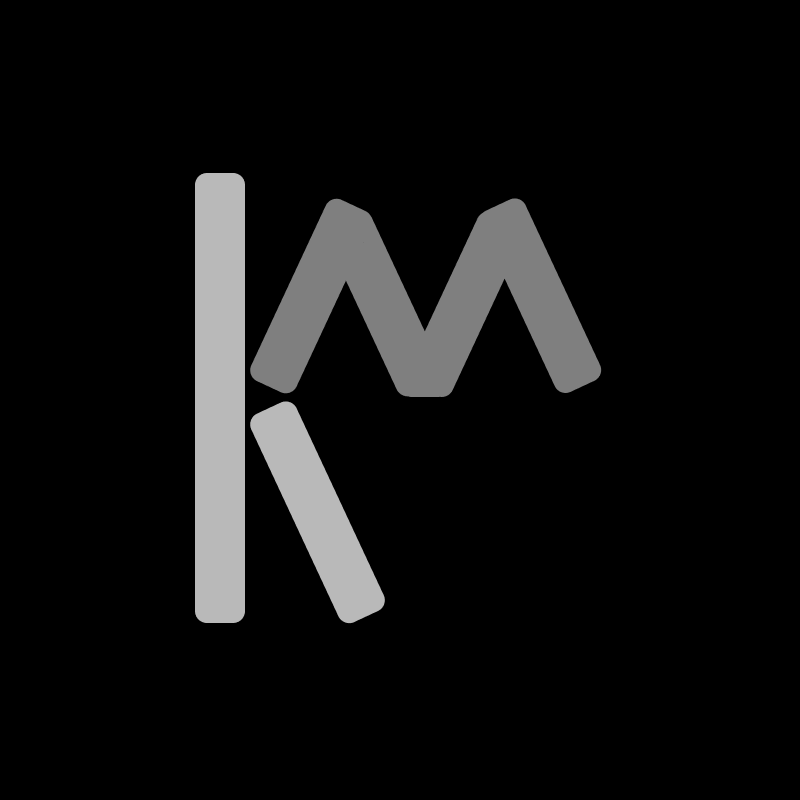

<!-- PROJECT SHIELDS -->
<!--
*** I'm using markdown "reference style" links for readability.
*** Reference links are enclosed in brackets [ ] instead of parentheses ( ).
*** See the bottom of this document for the declaration of the reference variables
*** for contributors-url, forks-url, etc. This is an optional, concise syntax you may use.
*** https://www.markdownguide.org/basic-syntax/#reference-style-links
-->

[![MIT License][license-shield]][license-url]
[![LinkedIn][linkedin-shield]][linkedin-url]
[![Netlify Status][netlify-shield]][netlify-shield-url]

<!-- PROJECT LOGO -->
 

  

<h3 align="center">Kerm.dev</h3>

  

    The Portfolio of Zak Kermitz, built with React/Tailwind stack and hosted on Netlify.
     
    <a href="https://github.com/KermWasTaken/portfolio-site"><strong>Explore the docs »</strong></a>
     
     
    <a href="https://kerm.dev">View The Site</a>
    ·
    <a href="https://github.com/KermWasTaken/portfolio-site/issues">Report Bug</a>
    ·
    <a href="https://github.com/KermWasTaken/portfolio-site/issues">Request Feature</a>
  

<!-- TABLE OF CONTENTS -->

  
Table of Contents

  <ol>
    <li>
      <a href="#about-the-project">About The Project</a>
      <ul>
        <li><a href="#built-with">Built With</a></li>
      </ul>
    </li>
    <li><a href="#license">License</a></li>
    <li><a href="#contact">Contact</a></li>
    <li><a href="#acknowledgments">Acknowledgments</a></li>
  </ol>

<!-- ABOUT THE PROJECT -->

## About The Project

[![Kerm.dev Screen Shot][site-screenshot]](https://kerm.dev)

This website is an interactive portfolio for my projects.

(<a href="#readme-top">back to top</a>)

### Built With

- [![React][React.js]][React-url]
- [![TailwindCSS][Tailwind]][Tailwind-url]
- [![Host][Netlify]][Netlify-url]

(<a href="#readme-top">back to top</a>)

<!-- LICENSE -->

## License

Distributed under the MIT License. See `LICENSE.txt` for more information.

(<a href="#readme-top">back to top</a>)

<!-- CONTACT -->

## Contact

Zak Kermitz - zakkermitz@gmail.com

Project Link: [https://github.com/KermWasTaken/portfolio-site](https://github.com/KermWasTaken/portfolio-site)

(<a href="#readme-top">back to top</a>)

<!-- ACKNOWLEDGMENTS -->

## Acknowledgments

- [Ari.gg](https://github.com/ceiphr/ari.gg)
- [React Icons](https://react-icons.github.io/react-icons/)
- [Best-README-Template](https://github.com/othneildrew/Best-README-Template/blob/master/README.md)
- [Img Shields](https://shields.io)

(<a href="#readme-top">back to top</a>)

<!-- MARKDOWN LINKS & IMAGES -->
<!-- https://www.markdownguide.org/basic-syntax/#reference-style-links -->

[license-shield]: https://img.shields.io/github/license/KermWasTaken/portfolio-site
[license-url]: https://github.com/KermWasTaken/portfolio-site/blob/master/LICENSE.txt
[linkedin-shield]: https://img.shields.io/badge/-LinkedIn-black.svg?logo=linkedin&colorB=555
[linkedin-url]: https://linkedin.com/in/zacharykermitz
[netlify-shield]: https://api.netlify.com/api/v1/badges/b1cc2ecb-8806-42d2-8ac2-7a214a40265e/deploy-status
[netlify-shield-url]: https://app.netlify.com/sites/kerm/deploys
[site-screenshot]: src/assets/portfolioSite.png
[React.js]: https://img.shields.io/badge/React-20232A?style=for-the-badge&logo=react&logoColor=61DAFB
[React-url]: https://reactjs.org/
[Tailwind]: https://img.shields.io/badge/tailwindcss-%2338B2AC.svg?style=for-the-badge&logo=tailwind-css&logoColor=white
[Tailwind-url]: https://tailwindcss.com/
[Netlify]: https://img.shields.io/badge/netlify-%23000000.svg?style=for-the-badge&logo=netlify&logoColor=#00C7B7
[Netlify-url]: https://www.netlify.com/
